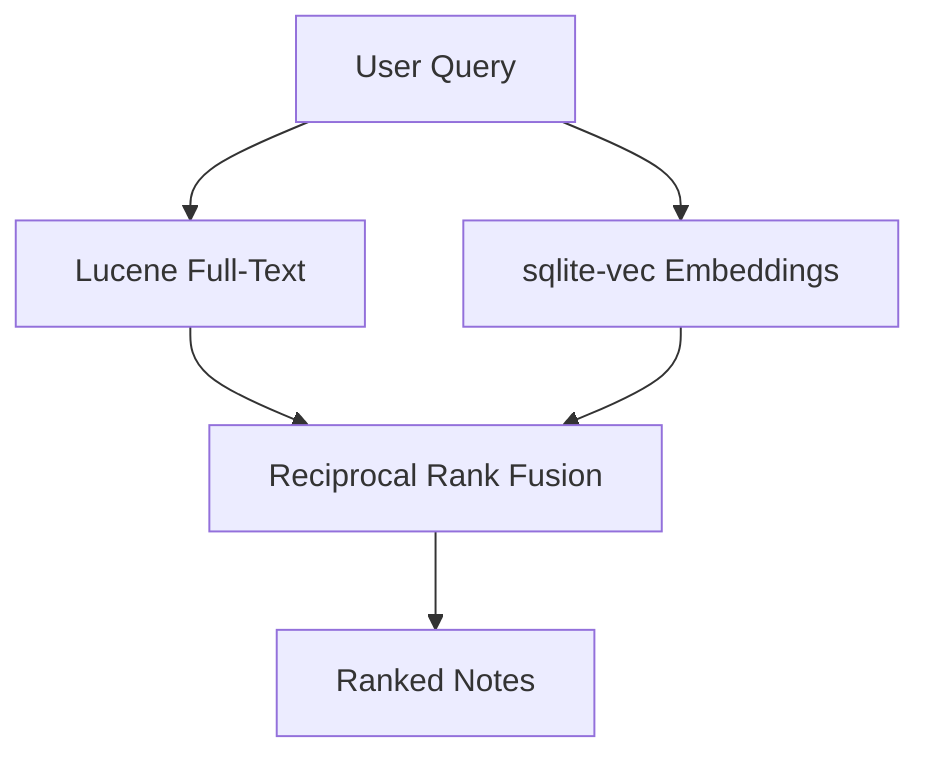

# AGENTS.md — Synapse

> **Synapse** is a local-first, AI-native cognitive gym built for connected thinking.

---

## 1. Project Overview

| Dimension        | Detail                                                                 |
|------------------|------------------------------------------------------------------------|
| **Purpose**      | AI-augmented linked note-taking with "Desirable Difficulty" mechanics |
| **Philosophy**   | Local-first, privacy-first, human-readable Markdown files on disk      |
| **Search**       | Hybrid: lexical (full-text) + semantic (vector) + local RAG           |
| **Storage**      | Markdown files on the local filesystem (Source of Truth)               |
| **Intelligence** | Local LLM (Ollama/llama.cpp) + local embeddings (sqlite-vec)          |

---

## 2. Technology Stack

### Desktop Client — Electron
| Layer         | Technology            | Purpose                                           |
|---------------|-----------------------|---------------------------------------------------|
| App Wrapper   | Electron 34           | Native desktop integration and process management |
| Process Mgmt  | Node.js Child Process | Manages Quarkus backend lifecycle                 |
| IPC Bridge    | Preload + Context     | Secure communication between Frontend and Backend  |

### Backend — Quarkus (Java 25)
| Layer         | Technology                              | Purpose                                     |
|---------------|-----------------------------------------|---------------------------------------------|
| Framework     | Quarkus 3.34.1                          | High-performance Java backend               |
| Build         | Maven (mvnw)                            | Build and dependency management             |
| Native Image  | GraalVM                                 | Zero-dependency native executable for distribution |
| Vector DB     | `sqlite-vec`                            | Local vector search & semantic embeddings   |

### Frontend — React + Vite
| Layer         | Technology                        | Purpose                                    |
|---------------|-----------------------------------|--------------------------------------------|
| Framework     | React 19                          | Component-driven UI                        |
| Editor        | CodeMirror 6                      | High-performance Markdown editor           |
| Bundler       | Vite 8                            | Fast development and optimized builds      |
| Resizing      | `react-resizable-panels`          | Flexible IDE-like layout                   |

---

## 3. Running the Project

### Development Mode
```bash
# Start the full environment (Electron + Quarkus + Vite)
npm start

# This script:
# 1. Boots Quarkus (which picks a random free port)
# 2. Starts Vite dev server (on port 5173)
# 3. Spawns Electron window
```

### Production Build
```bash
# 1. Build Quarkus native runner
./mvnw package -Dnative

# 2. Build Frontend assets
cd src/main/webui && npm run build

# 3. Package Desktop App (creates AppImage/Distt)
npm run package
```

---

## 4. Architecture

### 4.1 The Synapse Bridge (Electron ↔ Quarkus)
Electron acts as the orchestrator. On startup, `main.js` spawns the Quarkus native runner with `QUARKUS_HTTP_PORT=0`.
1. **Discovery:** Electron parses Quarkus logs to find the dynamic port.
2. **Injection:** The port is passed to the frontend via `window.ELECTRON_API`.
3. **Lifecycle:** When the Electron window closes, the backend process is killed.

### 4.2 Frontend Structure (`src/main/webui/src/`)
```
├── core/                           # Design system and API clients
├── features/                       # Domain-specific logic
│   ├── editor/                     # CodeMirror 6 implementation & extensions
│   ├── notes/                      # Note CRUD and management
│   ├── vault/                      # Vault/Neural Archive management
│   └── search/                     # Hybrid search interface
└── layouts/                        # AppShell with resizable panels
```

### 4.3 Search Pipeline


---

## 5. Domain Models & Note States

- **Dormant:** Raw capture, hidden from main feed for 48h. Requires "Original Thought" to activate.
- **Active:** Linked to a project, contains user-distilled content.
- **Mastered:** High density of bidirectional links, passed active recall quizzes.

---

## 6. Coding Conventions

- **CodeMirror Extensions:** Use `ViewPlugin` and `Decoration` for custom Markdown features (e.g., wikilink highlighting).
- **Offline First:** No feature should rely on an internet connection.
- **Type Safety:** Shared DTOs in `application/dto/` are the contract between Java and TypeScript.
- **Friction Logic:** Do not automate synthesis. Force the user to interact with the text (bolding, summary quizzes).

---

## 7. Current Screens

### 7.1 Vault Manager
- **Initialization**: Dedicated screen for creating new vaults or opening existing local directories.
- **Recent Archives**: Sidebar history for quick navigation between different knowledge bases.
- **Vault Context**: Displays the current active vault name and path in the Explorer.

### 7.2 Main Workspace (AppShell)
- **Explorer Sidebar**: Hierarchical file tree with support for folders, notes, drag-and-drop moving, and context-menu operations (Create, Rename, Delete).
- **Editor Area**: Multi-panel workspace using `react-resizable-panels`.
- **Tab System**: Supports multiple open notes with dirty-state tracking and auto-save.
- **Split Views**: Capability to drag tabs to the edge to split the editor into multiple groups.

### 7.3 Markdown Editor
- **Engine**: CodeMirror 6 with custom syntax highlighting.
- **Extensions**: High-performance `[[wikilink]]` styling and interactive link detection.
- **Auto-Sync**: Background debounced persistence to the local filesystem.

---

## 8. Definition of Done (DoD)
- **Privacy:** 100% offline. Zero network calls for note content.
- **Speed:** UI latency for auto-linking/search < 200ms.
- **Integrity:** Markdown remains the source of truth on disk.
